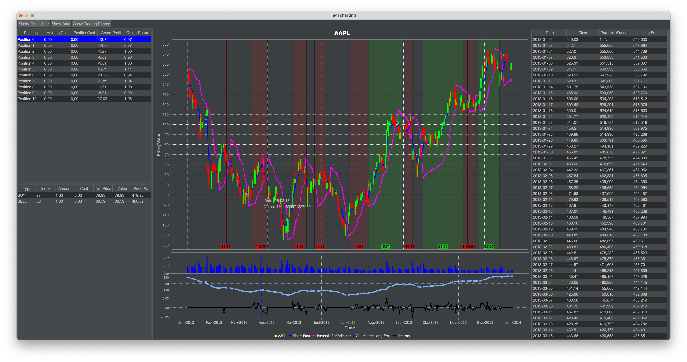
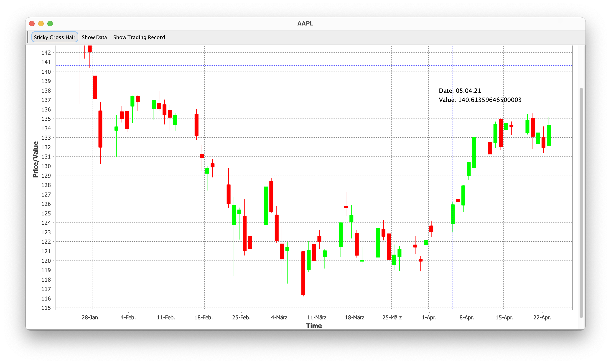
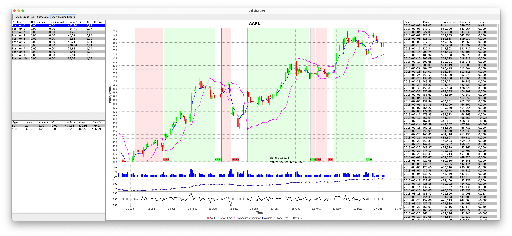
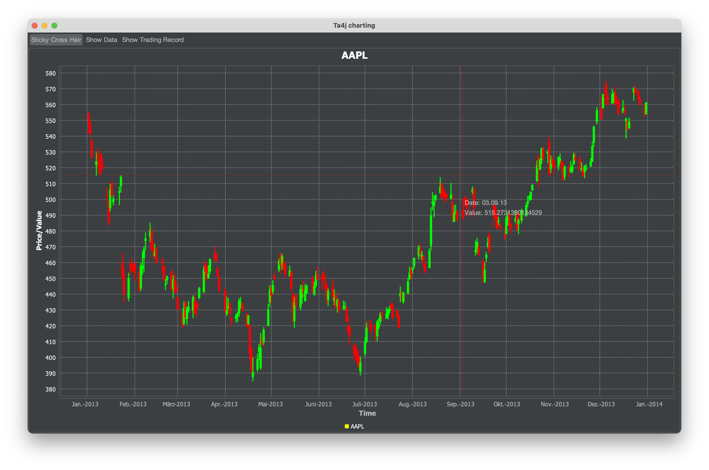

[](https://github.com/team172011/ta4jCharting/actions/workflows/test-action-master.yml) [](https://github.com/team172011/ta4jCharting/actions/workflows/test-action-develop.yml)
# Ta4jCharting
A simple charting application for [ta4j](https://github.com/ta4j/ta4j) using Swing and [jfreechart](https://github.com/jfree/jfreechart).

## Project structure
This project is a simple maven project with a parent pom and two modules for the ta4j-charting library and the example project
```text
└───ta4j-charting-parent
    ├───pom.xml
    ├───README.md
    └───lib
    │    ├───pom.xml
    │    └───src
    │         ├───main
    │         └───test
    │    
    │
    └───example
         ├───pom.xml
         └───src
             ├───main
             └───resources
```

## How to build
The example application and library can be build by executing:
```shell
> git clone https://github.com/team172011/ta4jCharting.git
> cd ta4jCharting
> mvn clean package
```

## How to start the example
After building the example application the example can be started by executing:
```shell
> java -jar example/target/example-0.0.1-SNAPSHOT.jar
```

## How to use
### Quick start
```java
final BarSeries barSeries = loadAppleIncSeries(); // create a ta4j bar series
TacChartBuilder.of(barSeries)
        .buildAndShow("AAPL");
```

### Build a chart with custom indicators and a trading record
```java
// 1 Create a barSeries, indicators and run your strategy with ta4j
final BarSeries barSeries = loadAppleIncSeries();
final VolumeIndicator volume = new VolumeIndicator(barSeries);
final ParabolicSarIndicator parabolicSar = new ParabolicSarIndicator(barSeries);
final ClosePriceIndicator closePrice = new ClosePriceIndicator(barSeries);
final EMAIndicator longEma = new EMAIndicator(closePrice, 12);
final EMAIndicator shortEma = new EMAIndicator(closePrice, 4);
final CrossedDownIndicatorRule exit = new CrossedDownIndicatorRule(shortEma, longEma);
final CrossedUpIndicatorRule entry = new CrossedUpIndicatorRule(shortEma, longEma);

final Strategy strategy = new BaseStrategy(entry, exit);
final TradingRecord tradingRecord = new BarSeriesManager(barSeries).run(strategy);

final Returns returns = new Returns(barSeries, tradingRecord, Returns.ReturnType.ARITHMETIC);

// 2 Use the ChartBuilder to create a plot with barSeries, indicators and trading record
TacChartBuilder.of(barSeries)
    .withIndicator(
        of(shortEma)
            .name("Short Ema")
            .color(Color.BLUE)) // default: ChartType.LINE, PlotType.OVERLAY
    .withIndicator(
        of(volume)
            .name("Volume")
            .plotType(PlotType.SUBPLOT)
            .chartType(ChartType.BAR)
            .color(Color.BLUE))
    withIndicator(
        of(parabolicSar)  // default name = toString()
            .plotType(PlotType.OVERLAY)
            .chartType(ChartType.LINE)
            .color(Color.MAGENTA))
    .withIndicator(
        of(longEma)
            .name("Long Ema")
            .plotType(PlotType.SUBPLOT)
            .chartType(ChartType.LINE)) // random color
    .withIndicator(
        of(returns)
            .name("Returns")
            .plotType(PlotType.SUBPLOT)
            .color(Color.BLACK)) // default: ChartType.LINE
    .withTradingRecord(tradingRecord)
    .buildAndShow(); // Creates and displays the JPanel in a JFrame
```

You can also use a dark theme:
```
TacChartBuilder.of(barSeries, Theme.DARK).buildAndShow();
```
